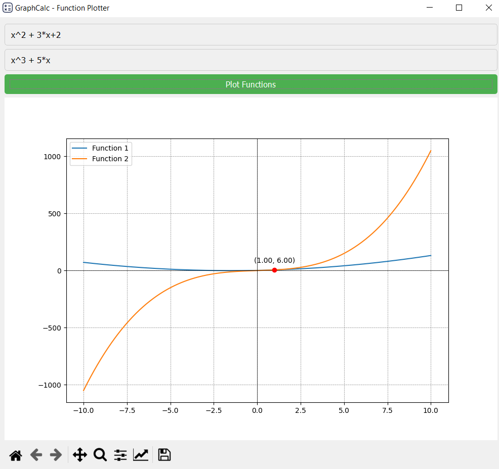
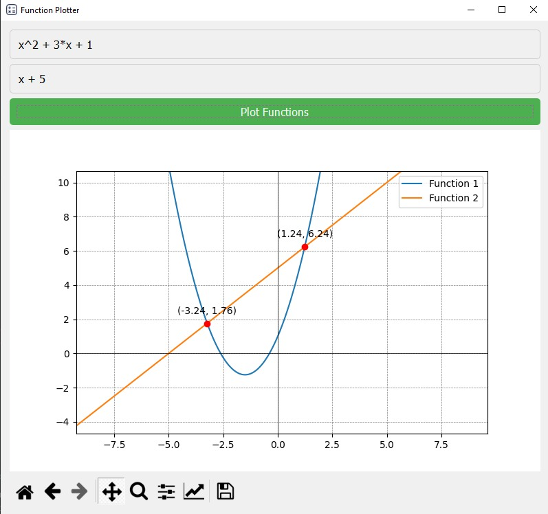
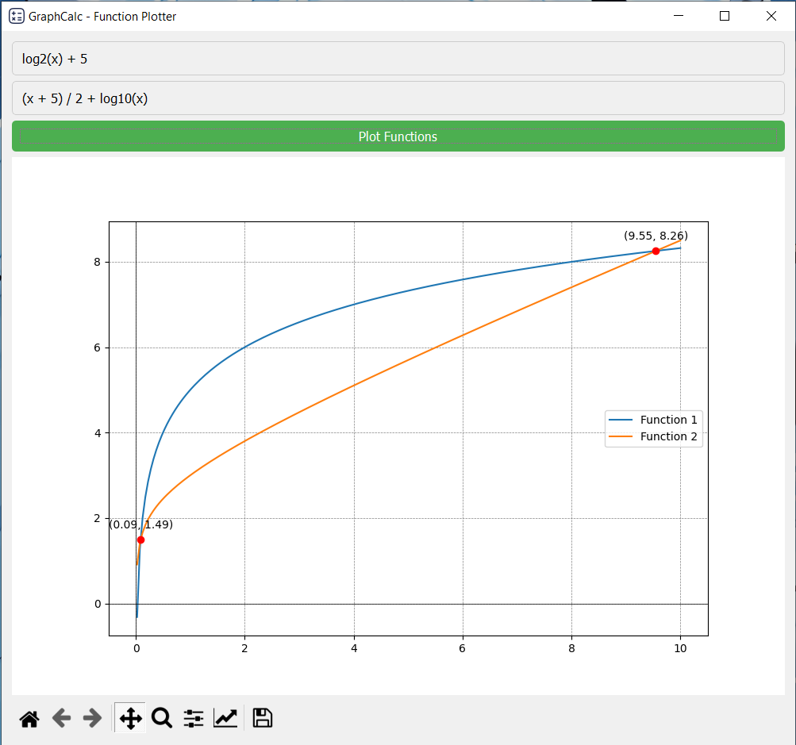
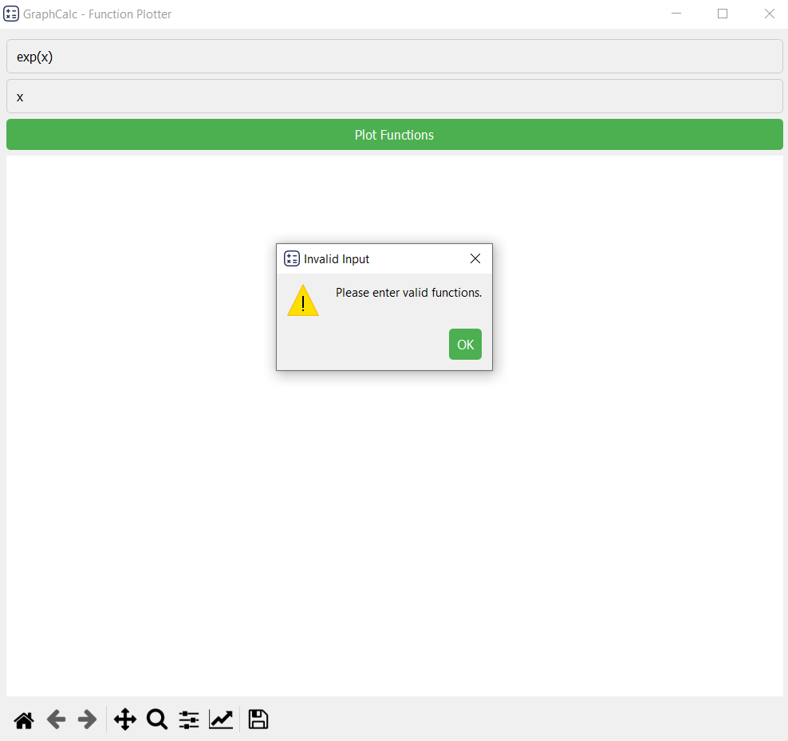
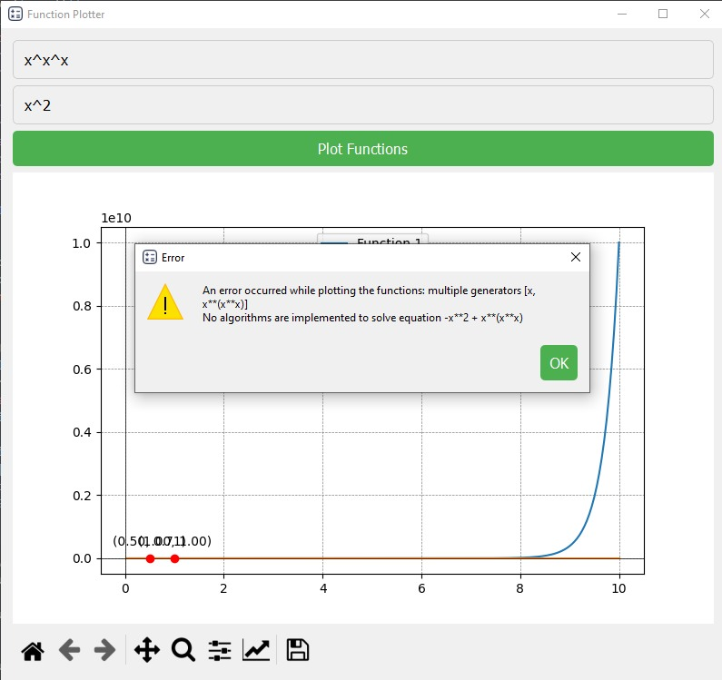

# **GraphCalc!**

<p align="center">
    
</p>


The **GraphCalc** is a Python-based application designed to visualize mathematical functions dynamically and interactively. With an intuitive GUI and a robust backend, this tool allows users to explore mathematical functions, analyze their intersections, and experiment with a variety of function types.

## **Features**

### **Core Functionalities**
1. **Function Visualization**:
   - Plots one or two mathematical functions simultaneously.
   - Offers support for a wide range of mathematical expressions, including polynomial, and logarithmic functions.

2. **Intersection Detection**:
   - Automatically calculates and highlights intersection points of two plotted functions (if present).
   - Provides numerical coordinates for these intersection points.

3. **Expression Parsing**:
   - Converts user-entered text-based functions into symbolic forms using `sympy`.
   - Supports advanced mathematical notations, including `logB(x) where b is any number`, and also can handle `Sqrt()` with main notaions `+,-,*,^,/` 

4. **Error Handling**:
   - Robust error-checking to validate user inputs.
   - Excludes invalid inputs, complex outputs, and edge cases to maintain plot accuracy.

### **Graphical User Interface (GUI)**
1. **Built with PySide2 (Qt)**:
   - Delivers a smooth, interactive experience.
   - Easily navigable layout designed for users with all levels of technical expertise.

2. **Key GUI Components**:
   - **Input Fields**: Two fields for entering functions to be plotted.
   - **Plot Button**: Triggers the plotting process and visualizes the results.
   - **Matplotlib Integration**: A Matplotlib canvas embedded within the GUI for real-time plotting.
   - **Navigation Toolbar**: Allows zooming, panning, and resetting the graph view.

3. **Interactive Graphs**:
   - Features gridlines, labels, and tooltips to enhance readability.
   - Automatically adjusts the graph axes to fit the plotted functions.

### **Testing Framework**
- Comprehensive testing suite implemented using `pytest`.
- Validates all backend functions, including:
  - Expression parsing and error handling.
  - Graph plotting with valid and invalid inputs.
  - Intersection point calculations.

---

## **Installation and Setup**

### **Prerequisites**
- Python 3.7 or higher.
- Recommended OS: Windows, macOS, or Linux.

### **Installation Steps**
1. Clone the repository:
   ```bash
   git clone https://github.com/MahmoudEssam707/GraphCalc
   cd GraphCalc
   ```

2. Install dependencies:
   ```bash
   pip install -r requirements.txt
   ```

3. Run the application:
   ```bash
   python main.py
   ```

---

## **How to Use the Application**

### **Launching the GUI**
1. Start the application by running the following command:
   ```bash
   python gui_main.py
   ```
2. Enter one or two mathematical functions into the provided input fields. For example:
   - `x^2 + 3*x + 2`
   - `x^3 + 5*x`
    this example demonstrates the application's ability to handle various types of functions and provide clear visualizations.

3. Click the **"Plot"** button to generate the graph.

    <p align="center">
        
    </p>
    

### **Testing Backend Logic**
To ensure the backend is functioning as expected, execute the test suite:
```bash
pytest
```

--- 
## **How to Use the Application**
 let's play with some examples
 it supports main polynomial functions:
   - `x^2 + 3*x + 1`
   - `x + 5`
<p align="center">
    
</p>

it supports main logarithm functions:
   - `log2(x)`
   - `(x + 5) / 2 + log10(x)`
<p align="center">
    
</p>

---
## **What you may face?**

1. **Some functions will be in the future**:
    - you may face tringometric functions, it not valid yet
    - same for exponential, it gonna be valid soon

    <p align="center">
         
    </p>

2. **it doesn't give me the answer i need!?**:
    - no, it will give you the right answer, that if you give him dump function, then it won't even evaluate it for you.

    <p align="center">
         
    </p>

---
## **Supported Mathematical Functions**

The GraphCalc supports a wide range of mathematical expressions, including:
- **Polynomials**: `x^2 + 3*x - 4`
- **Logarithmic Functions**: `log(x)`, `log2(x)`, `log10(x)` and more
- **Square Root Function**: via `sqrt(x)`
- **Fractions**: `(x^2 + 2) / (x - 1)`

---

## **Project Structure**

```plaintext
FunctionPlotter/
├── main.py            # Main script for launching the GUI
├── gui.py             # Main entry of whole QT Gui Design
├── Math.py            # Mathmatical Backend of the project
├── (gui_test,Math_test).py # are main parts of running test actions for the project
└── README.md              # Project documentation
```
---

## **Contact**
If you have questions, suggestions, or issues, feel free to reach out:
- **Email**: umahmoudessamu@gmail.com
- **Linked-in**: [Mahmoud Essam Fathy](https://www.linkedin.com/in/mahmoudessam7/)
